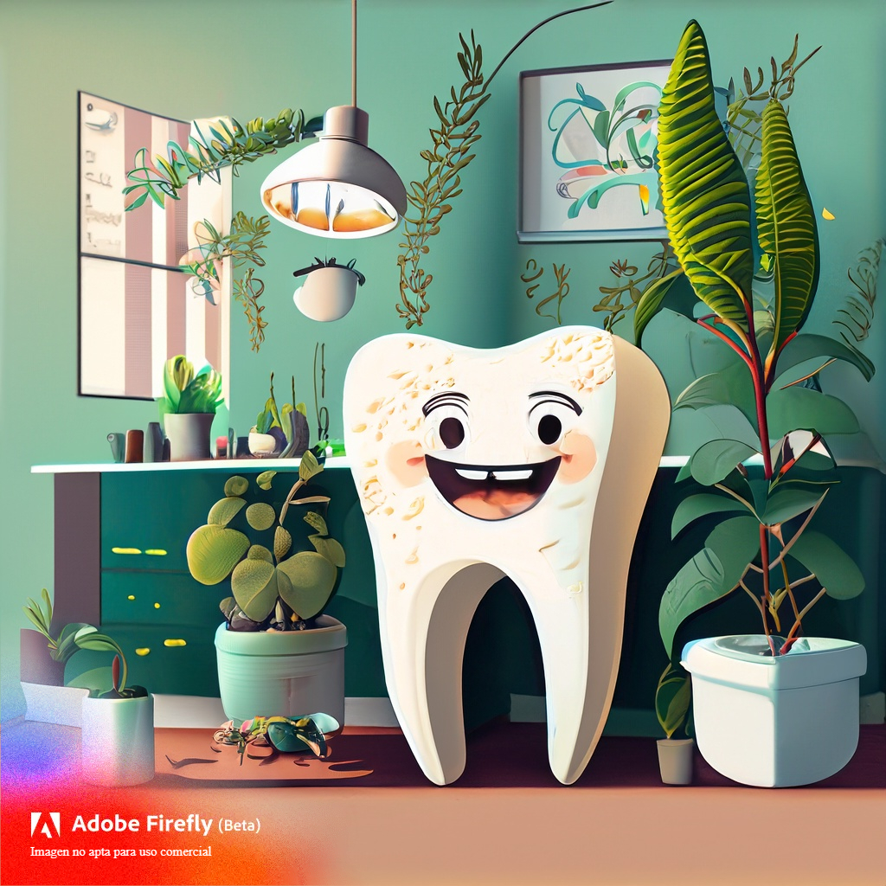
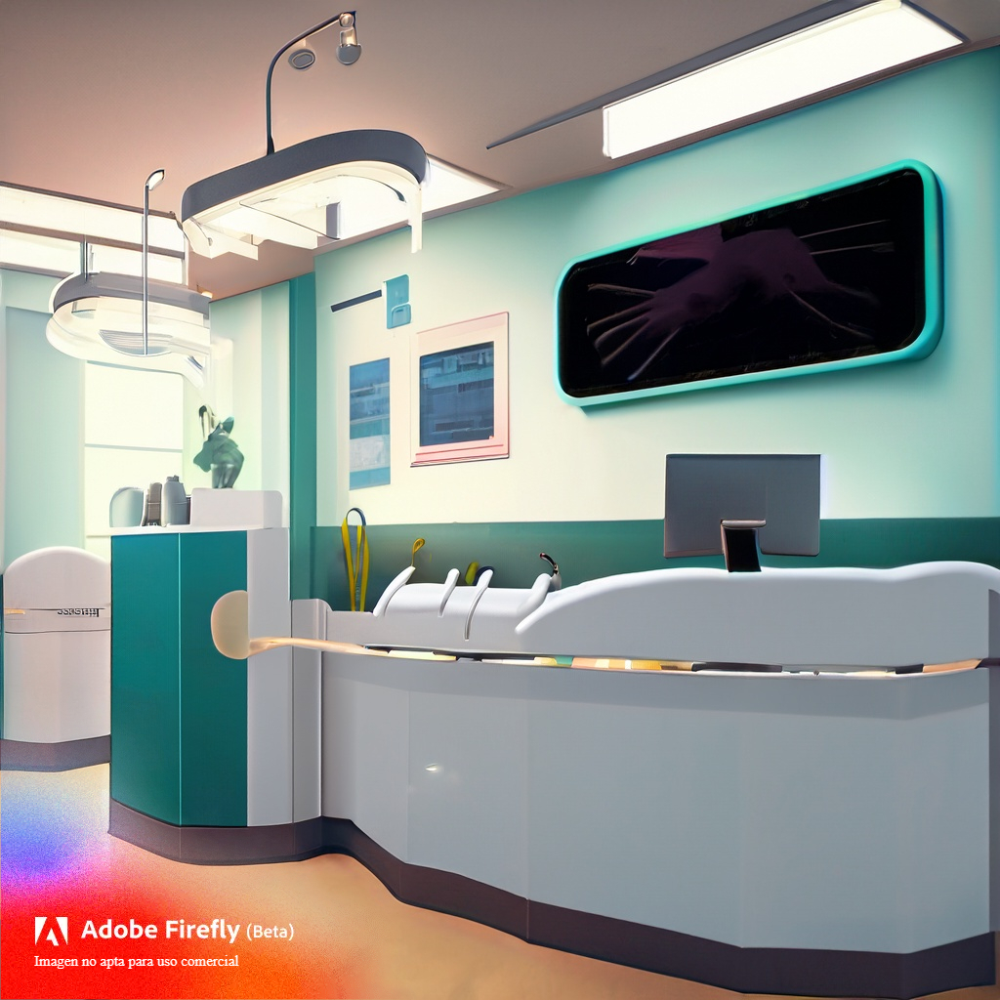

# 💻 Front-end III: Proyecto Integrador

¡Hola! 👋😀 Esta es mi solución para el Proyecto Integrador de la materia. Se trata de la creación de la interfaz gráfica
de una Clínica Odontológica.

¡Bienvenidos a **Dr. Sparkling's Dental Clinic**! 🦷✨

* [🌐 Vista general](#-vista-general)
    * [El desafío](#el-desafío)
    * [Sitio desplegado](#sitio-desplegado)
* [🔨 Mi proceso](#-mi-proceso)
    * [Construido con](#construido-con)
    * [Lo que aprendí](#lo-que-aprendí)
    * [Desarrollo continuo](#desarrollo-continuo)
    * [Recursos útiles](#recursos-útiles)
* [🙌 Agradecimientos](#-agradecimientos)

## 🌐 Vista general

### El desafío

Los usuarios de Dr. Sparkling's Dental Clinic deben ser capaces de:

- 🔍 Visualizar los odontólogos disponibles
- 🕵️‍♀️ Consultar los datos de contacto de cada odontólogo
- ⭐ Guardar sus odontólogos en Favoritos
- 📧 Contactarse con la clínica a través de un formulario
- 🌗 Cambiar el tema de color de la página
- 📦 Persistir sus ajustes en el `localStorage`

|  |  |
|------------------------------------------------------------------------------------------------------|-------------------------------------------------------------------------|

*© Imágenes creadas con [Adobe Firefly](https://firefly.adobe.com/).*

### Sitio desplegado

TBD.

## 🔨 Mi proceso

### Construido con

- HTML5 Semántico
- Propiedades de CSS Personalizadas
- Flexbox
- [Vite.js](https://vitejs.dev/)
- [React](https://react.dev/)
- [React Router](https://reactrouter.com/en/main)
- [Prop-Types](https://www.npmjs.com/package/prop-types)
- [Prettier](https://prettier.io/)

### Lo que aprendí

TBD.

### Desarrollo continuo

TBD.

### Recursos útiles

TBD.

## 🙌 Agradecimientos

TBD.